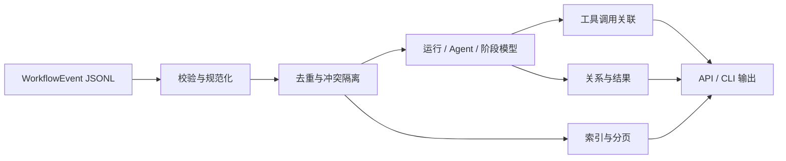

# Agent Trace Kit

[中文](./README.md) | [English](./README_EN.md)

Agent Trace Kit 是一个零依赖的 Node.js 库和 CLI，用于校验、整理与查询以 JSONL 保存的 Agent 工作流事件。它把原始事件还原为清晰的运行、任务 Agent、执行阶段、父子关系、工具调用、结果和已记录成本，帮助开发者理解 Agent 到底做了什么。

它适合 Agent 平台、自动化系统和本地调试工具使用。遇到缺失或相互冲突的证据时，Agent Trace Kit 会明确标记未知与歧义，而不是猜测一个看似完整的执行故事。

## 为什么需要它

Agent 运行通常会同时产生流式事件、工具调用、子任务和治理记录。仅查看原始日志很难回答这些问题：

- 一次运行是否真正结束，还是在中途停止？
- 哪个 Agent 创建了子任务，哪些 Agent 只是参与者？
- 工具调用是否获得了对应结果？
- 是否存在重放、重复 ID、冲突状态或未结算成本？
- 前端工作流、审计页面和调试 CLI 能否基于同一份事实？

Agent Trace Kit 为这些问题提供一个保守、可复用的事件模型。

## 核心能力

- 校验规范化工作流事件，并隔离身份冲突的记录。
- 对重放事件去重，同时保留冲突诊断。
- 按 workspace、session、run、task、agent 和事件类型精确过滤。
- 将事件归入稳定的执行阶段。
- 只根据已记录证据构建父子与参与关系。
- 关联工具调用和结果，包括乱序到达的事件。
- 识别未完成运行、冲突结果、未配对工具调用和未知成本。
- 提供内存索引、偏移分页、文本摘要和 JSON 输出。

该工具只读取本地数据，不调用模型、不访问 URL、不执行工具、不重放工作流，也不发送遥测。

## 工作原理



## 快速开始

要求 Node.js 22 或更高版本，无需安装依赖或构建。

```bash
git clone https://github.com/liulinlin718-netizen/agent-trace-kit.git
cd agent-trace-kit

node bin/agent-trace.js summary examples/research.jsonl
node bin/agent-trace.js validate examples/research.jsonl --json
node bin/agent-trace.js events examples/research.jsonl --run research-run --limit 20 --json
```

仓库中的示例为合成数据，包含完成与中断运行、事件重放、父子关系和未配对工具调用。

## 作为库使用

```js
import {
  readTraceFile,
  createTraceIndex,
  modelForEvents,
  summarizeTrace,
} from './src/index.js';

const trace = await readTraceFile('./examples/research.jsonl');
const model = modelForEvents(trace.events);

const index = createTraceIndex(trace.events);
const page = index.query(
  { sessionId: 'demo-session', runId: 'research-run' },
  { offset: 0, limit: 100 },
);

console.log(model.runs);
console.log(page.events);
console.log(summarizeTrace(trace.events));
```

项目提供 ESM 导出和 TypeScript 类型声明。

## 事件格式

每一行 JSONL 是一个 JSON 对象：

```json
{
  "eventId": "event-4",
  "sessionId": "session-1",
  "runId": "run-1",
  "taskId": "research-1",
  "agentId": "researcher",
  "type": "agent_tool_call",
  "timestamp": 1770000000000,
  "summary": "Read a public page.",
  "toolName": "read_url",
  "callId": "call-7"
}
```

必填字段为 `eventId`、`type` 和 `summary`。事件身份由 `(workspaceId, sessionId, runId, eventId)` 组成；同一身份的冲突记录会被排除并报告，不会静默采用先写或后写版本。

## 工具调用、关系与结果

工具调用只在相同 run、task、agent 和 tool 范围内配对：优先使用唯一 `callId`；没有 `callId` 的旧事件仅在存在唯一未关闭调用时配对。重用 ID、范围缺失和工具名冲突都会保持为歧义状态。

父子边要求同一运行中存在唯一父节点。缺失父节点、冲突声明和循环关系会被报告，而不会被渲染成虚构关系。运行结果来自明确的完成、失败、中断或取消事件；没有终止事件的运行标记为 `incomplete`。

工具结果事件只证明日志中记录了结果，不证明外部操作成功或返回内容正确。成本同样只读取明确字段，不推算供应商账单、汇率或缺失费用。

## CLI

```text
agent-trace summary <file> [filters] [--json]
agent-trace validate <file> [--json]
agent-trace events <file> [filters] [--offset N] [--limit N] [--json]
```

过滤条件包括 workspace、session、run、task、agent 和事件类型。CLI 只读取指定文件，并向 stdout/stderr 输出结果。

退出码：

- `0`：结构有效；其中仍可能包含生产者报告的失败任务。
- `2`：发现无效或冲突记录。
- `1`：参数、文件访问、文件变化或资源限制错误。

## 安全与边界

- 默认最多处理 50,000 个事件和 32 MiB 输入。
- 使用严格 UTF-8；错误 JSON 会被报告，不会自动修复。
- CLI 拒绝符号链接和非普通文件。
- 未知时间、身份、结果和成本保持未知。
- 日志可能包含隐私数据或密钥，共享前应先审查。
- JSONL 不是防篡改审计证据，事件生产者可能遗漏或错误记录信息。

本项目是 Trace 分析组件，不是 Orchestrator、执行器、沙箱、授权系统、事实核查器或质量 Benchmark。

## 测试与贡献

```bash
node --test test/*.test.js
```

测试只使用 Node.js 内置模块和本地合成数据。欢迎通过 [Issues](https://github.com/liulinlin718-netizen/agent-trace-kit/issues) 提交可复现问题；贡献代码时请保持证据语义保守，并为事件边界补充测试。

## 许可

[MIT License](./LICENSE)。设计提取自 TAgent 的规范工作流事件与任务实例模型，并重写为独立工具；来源说明见 [NOTICE](./NOTICE)。
