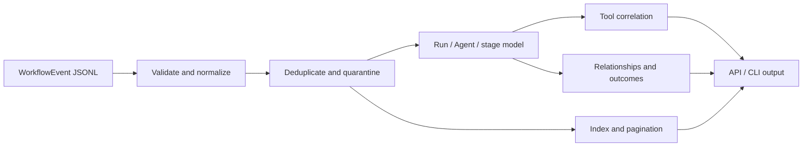
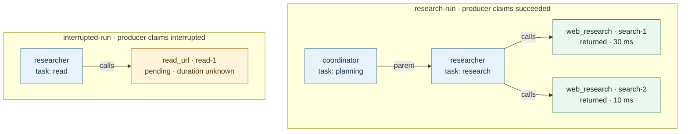

# Agent Trace Kit

[中文](./README.md) | [English](./README_EN.md)

Agent Trace Kit is a zero-dependency Node.js library and CLI for validating, organizing, and querying agent workflow events stored as JSONL. It turns raw events into an explicit model of runs, task agents, execution stages, parent relationships, tool interactions, outcomes, and recorded cost so developers can understand what an agent actually did.

It is designed for agent platforms, automation systems, and local debugging tools. When evidence is missing or contradictory, Agent Trace Kit reports uncertainty instead of inventing a complete-looking execution story.

[Quick Start](#quick-start) · [Example Walkthrough](#example-walkthrough) · [Library Usage](#library-usage) · [Safety and Limits](#safety-and-limits)

## Why It Exists

Agent runs often emit streaming events, tool calls, child tasks, and governance records at the same time. Raw logs alone make it difficult to answer:

- Did a run really finish, or did it stop midway?
- Which agent created a child task, and which agents merely participated?
- Did every tool call receive a matching result?
- Are there replayed records, duplicate identities, conflicting states, or unknown cost?
- Can workflow UI, audit views, and debugging tools share one source of truth?

Agent Trace Kit provides a conservative, reusable event model for those questions.

## Core Capabilities

- Validate canonical workflow events and quarantine conflicting identities.
- Deduplicate replayed events while preserving conflict diagnostics.
- Filter exactly by workspace, session, run, task, agent, and event type.
- Group events into stable execution stages.
- Build parent and participation relationships only from recorded evidence.
- Correlate tool calls and results, including out-of-order records.
- Identify incomplete runs, conflicting outcomes, unmatched tools, and unknown cost.
- Provide in-memory indexes, offset pagination, text summaries, and JSON output.

The toolkit reads local data only. It does not call a model, fetch URLs, execute tools, replay workflows, or send telemetry.

## How It Works



## Quick Start

Requires Node.js 22 or newer. No dependency installation or build step is required.

```bash
git clone https://github.com/liulinlin718-netizen/agent-trace-kit.git
cd agent-trace-kit

node bin/agent-trace.js summary examples/research.jsonl
node bin/agent-trace.js validate examples/research.jsonl --json
node bin/agent-trace.js events examples/research.jsonl --run research-run --limit 20 --json
```

The bundled example uses synthetic data and includes completed and interrupted runs, replayed events, parent relationships, and unmatched tool calls.

## Example Walkthrough

This diagram is derived from the public [research.jsonl](./examples/research.jsonl) fixture. It shows recorded parent relationships and tool-call ownership. It is an **illustration of a synthetic trace, not an application screenshot or evidence that this toolkit executed a web search**.



What the example demonstrates:

| What the log contains | What the analysis reports |
| --- | --- |
| 15 input records, including one replay of `e07` | 14 accepted events and 1 duplicate copy, without double-counting |
| `search-2` returns before `search-1` | Correct `callId` pairs with 10 ms and 30 ms durations, not a guess based on return order |
| An explicit parent agent and task for the researcher | A coordinator → researcher parent edge |
| A `read_url` call with no result before interruption | The call stays `pending` and the run stays `interrupted`; no result is invented |
| A completion record with total cost `0.003` | One recorded total, without adding agent costs or interpreting it as a bill |
| A source with an unknown publication date | A preserved governance warning; a returned result is not verified content |

The Quick Start `summary` command produces this actual terminal excerpt; omitted lines do not change the displayed values:

```text
Agent Trace Kit
Events: 14 accepted; 1 duplicate copies; 0 invalid; 0 conflicting identities.

Run interrupted-run | session demo-session | interrupted
  Recorded run cost: unknown (not a billing total)
  Tool read_url | task read | call read-1 | pending | none | duration unknown | outcome unknown

Run research-run | session demo-session | succeeded
  Recorded run cost: 0.003 (not a billing total)
    Parent: coordinator[planning] -> researcher[research]
  Tool web_research | task research | call search-1 | returned | call_id | 30 ms | outcome unknown
  Tool web_research | task research | call search-2 | returned | call_id | 10 ms | outcome unknown
```

`returned` means a result record exists, not that the search content is correct. The fixture does not explicitly declare tool success, so tool outcomes stay `unknown`. Run-level `succeeded` is also a producer claim, not independent certification of task quality.

## Library Usage

```js
import {
  readTraceFile,
  createTraceIndex,
  analyzeCollectedTrace,
} from './src/index.js';

const trace = await readTraceFile('./examples/research.jsonl');
const report = analyzeCollectedTrace(trace);

const index = createTraceIndex(trace);
const page = index.query(
  { sessionId: 'demo-session', runId: 'research-run' },
  { offset: 0, limit: 100 },
);

console.log(report.runs);
console.log(report.counts, report.issues);
console.log(page.events);
```

ESM exports and TypeScript declarations are included.

For a file summary alone, use one entry point:

```js
import { analyzeTraceFile } from './src/index.js';

const report = await analyzeTraceFile('./examples/research.jsonl', {
  filter: { runId: 'research-run' },
});
console.log(report.filtered, report.selectedEventCount, report.issues);
```

Passing the complete `trace` preserves original counts, diagnostics, and line/byte locations while reusing validated data. Filtered summaries explicitly describe partial evidence; original ingestion diagnostics remain visible even when problem events are filtered out.

`trace` is a library-owned, read-only batch whose property reads return defensive copies. `trace.evidence` retains original normalized records (including replays and conflicting versions) and source locations; it can contain private data/tool arguments and is not dumped by the CLI. Compose with the batch itself, not a spread/cloned plain object. Raw in-memory records can still use `summarizeTrace(events)`; low-level `modelForEvents` requires already sorted, deduplicated, normalized events.

## Event Shape

Each JSONL line contains one JSON object:

```json
{
  "eventId": "event-4",
  "sessionId": "session-1",
  "runId": "run-1",
  "taskId": "research-1",
  "agentId": "researcher",
  "type": "agent_tool_call",
  "timestamp": 1770000000000,
  "summary": "Read a public page.",
  "toolName": "read_url",
  "callId": "call-7"
}
```

Required fields are `eventId`, `type`, and `summary`. Event identity is `(workspaceId, sessionId, runId, eventId)`. Conflicting records with the same identity are excluded and reported; neither first-write nor last-write silently wins.

Root fields and supported identity/tool aliases in `data` deduplicate by meaning; canonical events retain only promoted fields. Other extension data and tool arguments still participate in conflict detection. Replays of every conflicting version count as duplicates, independently of input order.

## Tools, Relationships, and Outcomes

Tool calls are paired only within the same run, task, agent, and tool scope. A unique `callId` is preferred; legacy records without one pair only when a single earlier anonymous call is open. Reused IDs, missing scope, and conflicting tool names remain ambiguous.

Parent edges require one uniquely observed parent in the same run. Missing parents, conflicting claims, and cycles are reported instead of rendered as invented relationships. Outcomes come from explicit completion, failure, interruption, or cancellation events; a run without a terminal event is `incomplete`.

Without `runId`, events form only an unassigned bucket (`scopeStatus: 'unassigned'`): no parent/participation edges or tool pairs, no merged agent instances, and unknown aggregate outcome/cost. Callers who know the real run identity can explicitly supply it on input; random IDs must not substitute for evidence. Contradictory success claims emit `conflicting_outcome`. Conflicting run costs emit `conflicting_run_cost` and produce a `null` total, with candidate amounts retained in `costEvidence`.

A tool result event proves only that the trace contains a result. It does not prove that an external action succeeded or that returned content is correct. Cost is read from explicit fields and never inferred from provider billing, exchange rates, or missing charges.

## CLI

```text
agent-trace summary <file> [filters] [--json]
agent-trace validate <file> [--json]
agent-trace events <file> [filters] [--offset N] [--limit N] [--json]
```

Filters include workspace, session, run, task, agent, and event type. The CLI reads only the supplied file and writes to stdout/stderr.

Exit codes:

- `0`: structurally valid; producer-reported failed tasks may still be present.
- `2`: invalid or conflicting records were reported.
- `1`: usage, file access, file change, or resource-limit error.

## Safety and Limits

- Maximum 50,000 events and 32 MiB input by default.
- Strict UTF-8; malformed JSON is reported, not repaired.
- Symbolic links and non-regular files are rejected by the CLI reader.
- Unknown timestamps, identities, outcomes, and costs remain unknown.
- Logs may contain private data or secrets; review exports before sharing.
- JSONL is not tamper-proof audit evidence; producers may omit or misstate events.

This project is a trace analysis component, not an orchestrator, executor, sandbox, authorization system, fact checker, or quality benchmark.

## Tests and Contributing

```bash
node --test test/*.test.js
```

Tests use Node.js built-ins and synthetic local data only. Reproducible reports are welcome in [Issues](https://github.com/liulinlin718-netizen/agent-trace-kit/issues). Code contributions should preserve conservative evidence semantics and include tests for event-boundary behavior.

## License

[MIT License](./LICENSE). The design was extracted from TAgent's canonical workflow event and task-instance model and rewritten as a standalone tool. See [NOTICE](./NOTICE) for provenance.
